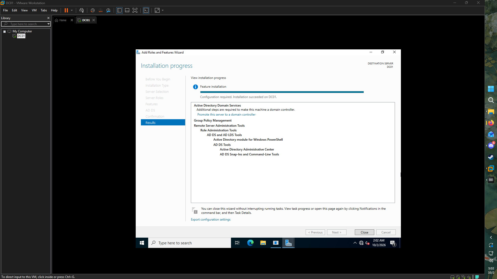
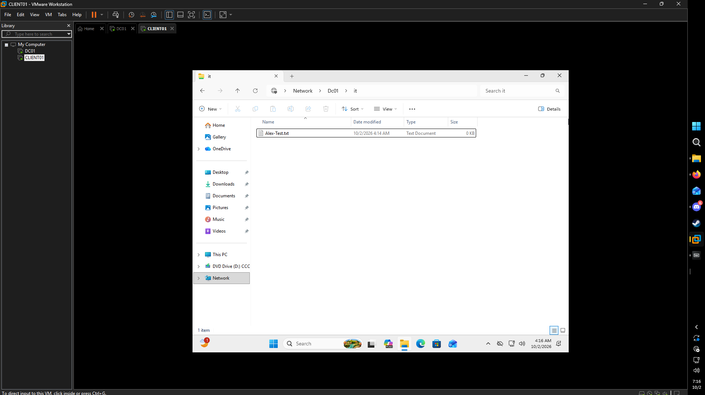
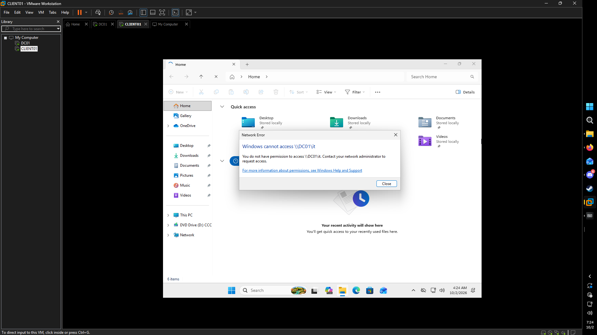
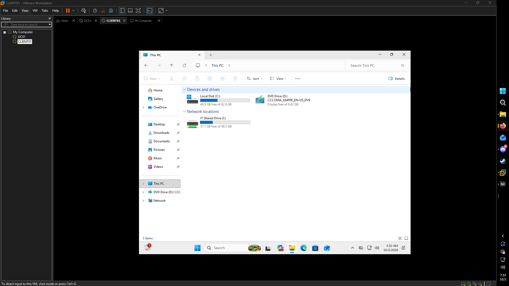

# Active Directory Home Lab

**John Sunga** | [LinkedIn](https://www.linkedin.com/in/yelo/)

## Overview

This project documents an Active Directory home lab I built to gain hands-on experience with Windows Server administration, Active Directory Domain Services (AD DS), Group Policy, user and group management, file sharing, permissions, and Windows client administration.

The lab simulates a small business environment using a Windows Server 2022 domain controller and a domain-joined Windows client.

---

## Lab Environment

- VMware Workstation
- Windows Server 2022
- Windows Client
- Active Directory Domain Services (AD DS)
- DNS
- Group Policy Management
- NTFS and Share Permissions

### Domain Information

- **Domain:** `adlab.test`
- **NetBIOS Domain:** `ADLAB`
- **Domain Controller:** `DC01`
- **Client Workstation:** `CLIENT01`
- **DC01 IP Address:** `192.168.111.128`

---

## 1. Windows Server Setup

I created a Windows Server 2022 virtual machine named `DC01` in VMware Workstation to serve as the domain controller for the lab.

I configured a static IPv4 address for the server so the domain controller and DNS server would maintain a consistent network address.

---

## 2. Active Directory Domain Services

I installed the Active Directory Domain Services role on `DC01`.

I then promoted `DC01` to a domain controller and created a new Active Directory forest:

`adlab.test`

---

## 3. Organizational Unit Structure

I created Organizational Units (OUs) to organize users, computers, groups, and departments.

The structure includes:

- **Employees**
  - IT
  - HR
  - Sales
  - Management
- **Company Computers**
  - Workstations
  - Servers
- **Groups**
- **Disabled Users**

---

## 4. User Account Management

I created multiple domain user accounts and placed them into their appropriate departmental OUs.

This provided hands-on experience with Active Directory user creation and organizational management.

---

## 5. Security Groups

I created departmental security groups:

- `IT-Staff`
- `HR-Staff`
- `Sales-Staff`
- `Management-Staff`

Users were assigned to the appropriate groups so permissions could be managed through group membership instead of assigning permissions individually.

---

## 6. Domain-Joined Workstation

I configured a Windows client named `CLIENT01` and joined it to the `adlab.test` domain.

I verified domain authentication by signing into `CLIENT01` using the domain account `ADLAB\ajohnson`.

I also moved the `CLIENT01` computer object into the **Workstations** OU for centralized management.

---

## 7. Group Policy

I created a Group Policy Object named:

`Employee - Restrict Control Panel`

The policy was linked to the **Employees** OU and configured to prevent employee accounts from accessing Control Panel and Windows Settings.

I updated Group Policy on the client and verified that the policy was successfully applied to the domain user.

---

## 8. Department File Share

I created an IT department network share on `DC01`:

`\\DC01\IT`

Access to the shared folder was controlled using the `IT-Staff` Active Directory security group.

Authorized IT users were given permission to access and modify files within the share.

I also tested the permissions to verify that access restrictions worked as intended.

---

## 9. Group Policy Drive Mapping

I configured Group Policy Preferences to automatically map the IT department's shared folder as a network drive.

The network share:

`\\DC01\IT`

was mapped as the `I:` drive on the Windows client.

---

## Skills Demonstrated

Through this project, I gained hands-on experience with:

- Windows Server 2022 administration
- Active Directory Domain Services (AD DS)
- Domain controller configuration
- DNS configuration
- Active Directory Users and Computers (ADUC)
- Organizational Units (OUs)
- User account administration
- Security groups
- Group Policy Objects (GPOs)
- Windows domain joining
- NTFS permissions
- Share permissions
- Role-based access control
- Network file shares
- Group Policy Preferences
- Network drive mapping
- Active Directory troubleshooting

---

## Key Takeaways

This lab helped me understand how Active Directory can be used to centrally manage users, computers, security groups, permissions, and policies within a Windows domain environment.

I also gained hands-on troubleshooting experience with Group Policy, domain authentication, file sharing, and permissions. The project demonstrated how Active Directory security groups, NTFS permissions, share permissions, and Group Policy work together to manage access to organizational resources.
