# Active Directory Home Lab

## Overview

This project documents the Active Directory home lab I built to gain hands-on experience with Windows Server administration, Active Directory Domain Services, Group Policy, user and group management, file sharing, permissions, and Windows client administration.

The lab simulates a small business environment with a Windows Server domain controller and a domain-joined Windows client.

## Lab Environment

- VMware Workstation
- Windows Server 2022
- Windows 11 Client
- Active Directory Domain Services (AD DS)
- DNS
- Group Policy Management
- NTFS and Share Permissions

## Network Configuration

| Device | Role | IP Address |
|---|---|---|
| DC01 | Domain Controller / DNS Server | 192.168.111.128 |
| CLIENT01 | Domain-joined workstation | DHCP |

Domain:

`adlab.test`

NetBIOS Domain:

`ADLAB`

## What I Configured

### 1. Windows Server and Domain Controller

I installed Windows Server 2022, configured a static IP address, installed Active Directory Domain Services, and promoted the server to a domain controller.

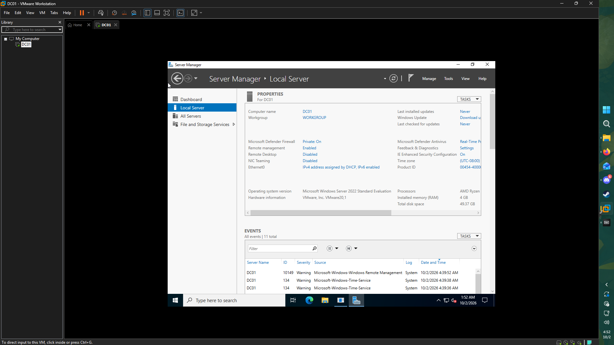

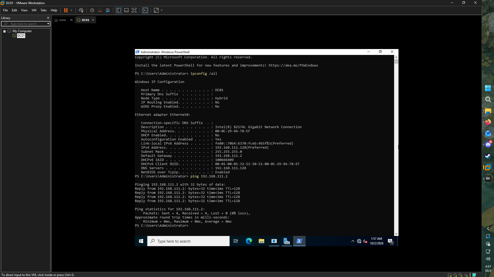

### 2. Active Directory Domain

I created the `adlab.test` Active Directory forest and configured `DC01` as the domain controller.

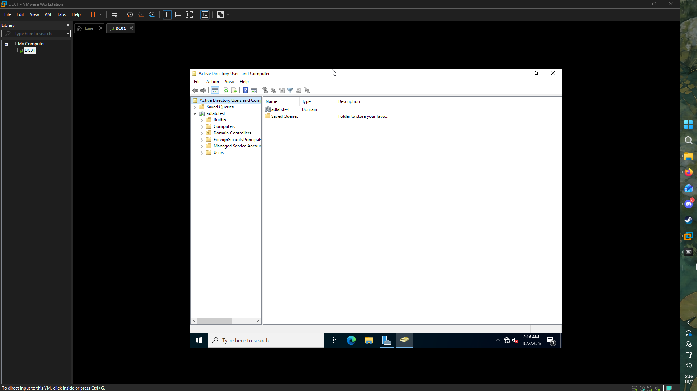

### 3. Organizational Units

I created an OU structure to organize users, computers, groups, and departments.

The structure includes:

- Employees
  - IT
  - HR
  - Sales
  - Management
- Company Computers
  - Workstations
  - Servers
- Groups
- Disabled Users

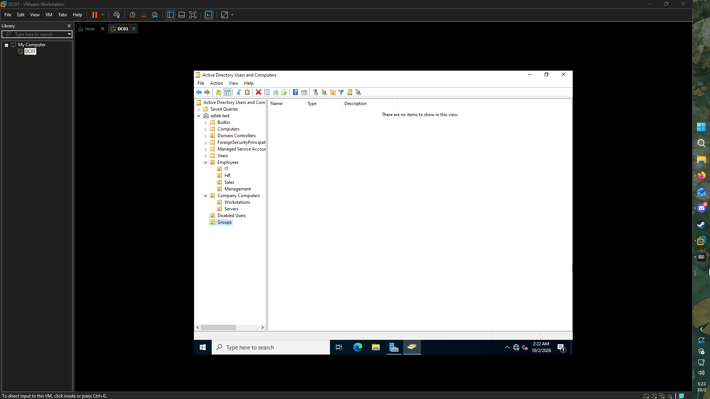

### 4. Users and Security Groups

I created multiple test users and organized them into departmental OUs.

I also created security groups for:

- IT-Staff
- HR-Staff
- Sales-Staff
- Management-Staff

Users were assigned to their appropriate security groups.

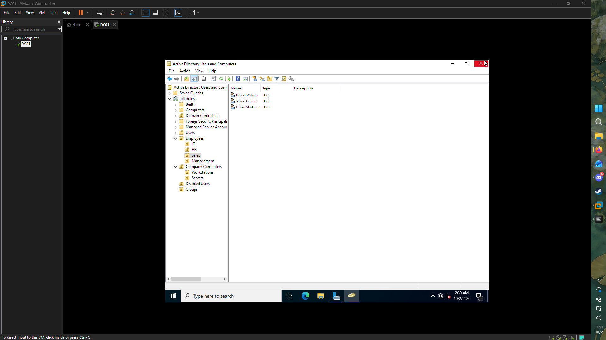

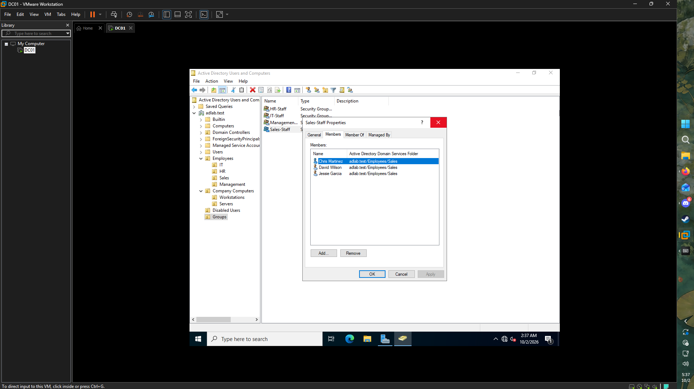

### 5. Domain-Joined Windows Client

I configured a Windows 11 virtual machine and joined it to the `adlab.test` domain.

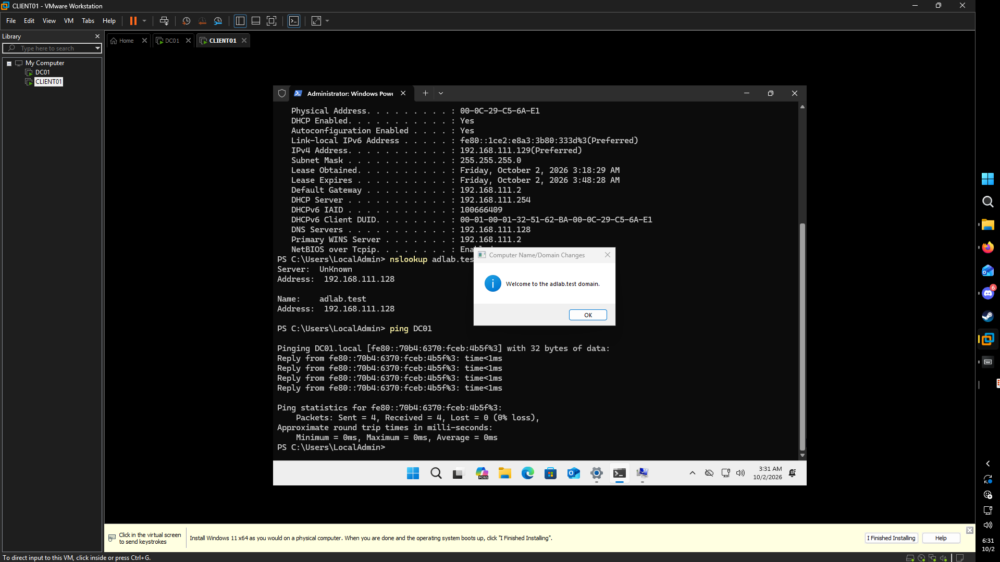

I then verified that a domain user could successfully sign in to the workstation.

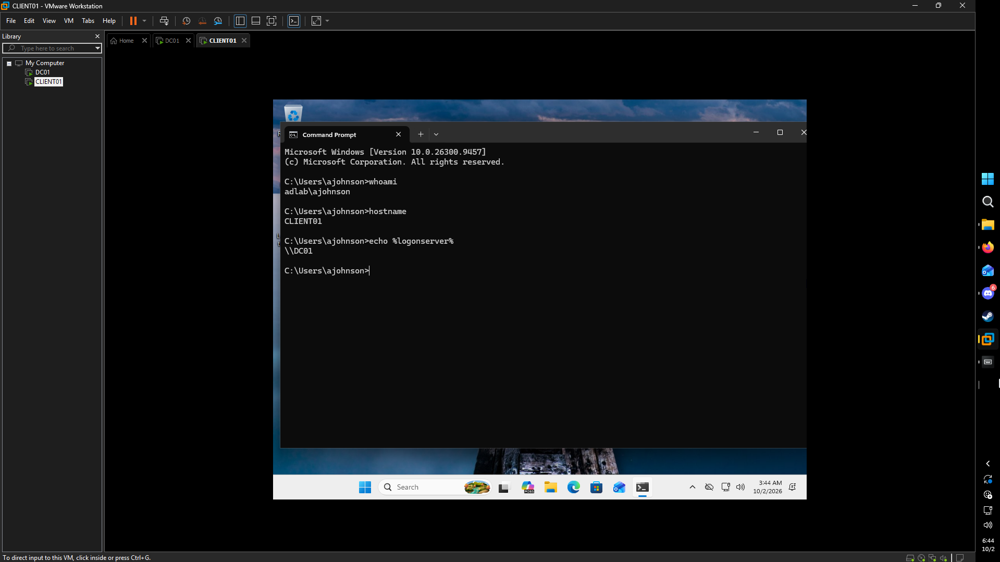

### 6. Computer Organization

The domain-joined workstation was moved into the appropriate Workstations OU to demonstrate Active Directory computer management.

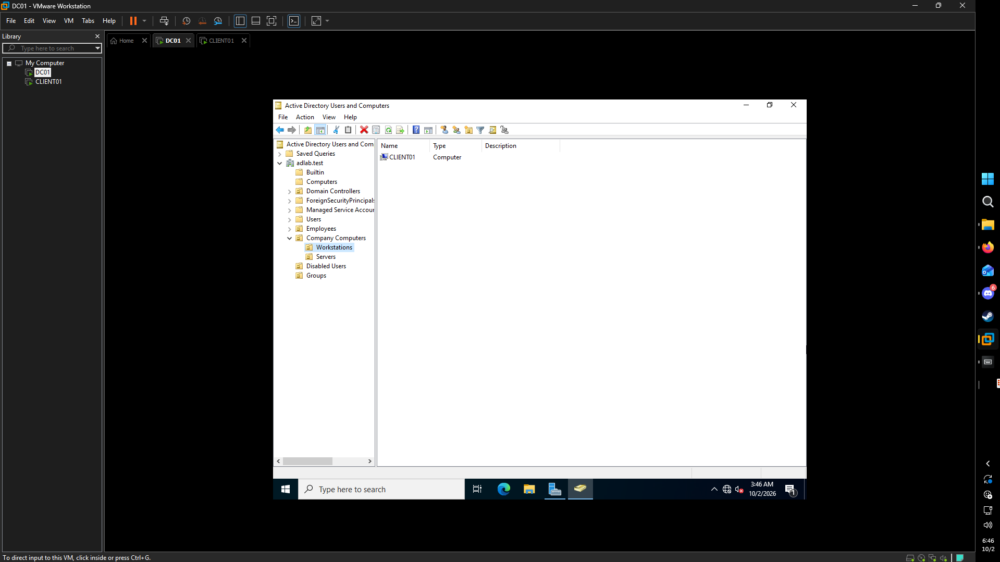

### 7. Group Policy

I created and applied a Group Policy Object to the Employees OU that restricts access to Windows Control Panel and Settings.

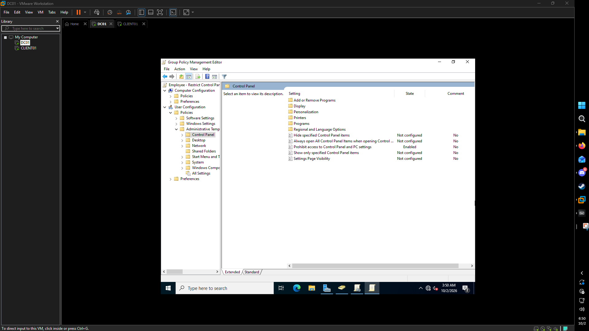

I verified the policy on the client using Group Policy tools.

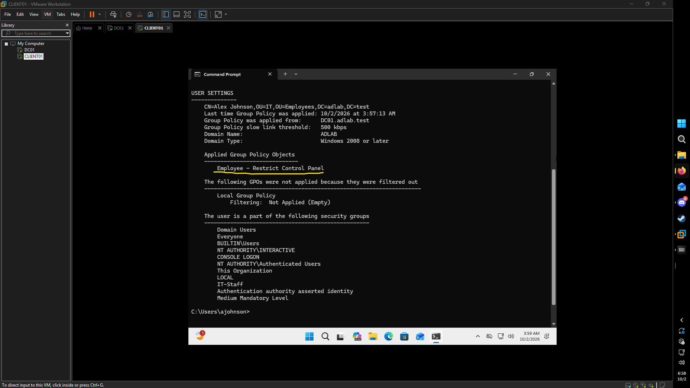

### 8. Department File Share

I created an IT department network share on `DC01`.

The share uses Active Directory security group membership to control access. Members of `IT-Staff` were granted Modify permissions while unauthorized users were restricted.

### 9. Automatic Drive Mapping

I configured Group Policy Preferences to automatically map the IT shared folder as a network drive for the client.

The mapped drive points to:

`\\DC01\IT`

## Skills Demonstrated

Through this project, I gained hands-on experience with:

- Active Directory Domain Services
- Windows Server 2022 administration
- Domain controller configuration
- DNS
- Active Directory users and computers
- Organizational Units
- Security groups
- Group Policy
- Windows domain joining
- NTFS permissions
- Share permissions
- Role-based access control
- Network file shares
- Group Policy Preferences
- Network drive mapping
- Basic Active Directory troubleshooting

## What I Learned

This lab helped me understand how Active Directory is used to centrally manage users, computers, permissions, and policies in a Windows domain environment.

I also gained experience troubleshooting Group Policy and file permissions and learned how NTFS permissions, share permissions, security groups, and Group Policy work together in a domain environment.
